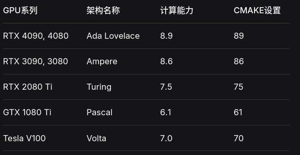

# 25年步哨神经网络识别部分抽离

## 代码结构说明


## 相关依赖安装

1. 安装华睿相机驱动

下载 [https://www.notion.so/53ec205d5ccb4187bd07631cd613ab5e?pvs=4#223ce6564d68402794644a2df7a92f0c](https://www.notion.so/53ec205d5ccb4187bd07631cd613ab5e?pvs=4#223ce6564d68402794644a2df7a92f0c) 并解压，在文件夹内命令行输入：

```sh
chmod +x ./MVviewer_Ver2.3.2_Linux_x86_Build20220331.run
sudo ./MVviewer_Ver2.3.2_Linux_x86_Build20220331.run
```

2. 配置神经网络相关环境
   
大致为安装显卡驱动、tensorrt、cuda,详情参看哈工大竞技机器人队B站帐号上的配置教程

## 使用说明

1. 相机测试

首先在安装完大华相机驱动后，执行命令
```sh
cd /opt/HuarayTech/MVviewer/bin
./run.sh
```
测试相机是否能够正常捕捉图像

或在camer目录下，将编译demo的选项开启，执行可执行文件测试

2. 主目录下Cmakelists文件更改配置

```cmake
set(CMAKE_CUDA_ARCHITECTURES 89) # 设置GPU架构
set(TENSORRT_PATH "/usr/local/TensorRT-10.0.1.6") # 设置为 TensorRT 安装路径
```
+ GPU架构查询
    输入nvidia-smi后，根据显卡型号对照查询
    
+ tensorrt安装路径配置为你自己安装的路径

3. 网络引擎文件生成

首先进入tensorrt的安装路径的bin文件夹，例
```sh
cd /usr/local/TensorRT-10.0.1.6/bin
```
解压文件夹中的deploy.zip将其存放到一个位置，比如主目录

然后运行下列程序，例
```sh
./trtexec --onnx=/home/trevitz/7.29.onnx --saveEngine=/home/trevitz/7.29.engine --staticPlugins=/home/trevitz/deploy/lib/plugin/libcustom_plugins.so --setPluginsToSerialize=/home/trevitz/deploy/lib/plugin/libcustom_plugins.so  --fp16
```
***注意***上述的--onnx路径改成文件夹中给的onnx路径，--staticPlugins、--setPluginsToSerialize改成你放置的deploy路径，--saveEngine保存位置自行配置。

执行完毕后终端大概会输出
```sh
[09/08/2025-20:11:30] [I] === Performance summary ===
[09/08/2025-20:11:30] [I] Throughput: 742.821 qps
[09/08/2025-20:11:30] [I] Latency: min = 1.23303 ms, max = 4.12598 ms, mean = 1.73074 ms, median = 1.38422 ms, percentile(90%) = 2.68469 ms, percentile(95%) = 2.87158 ms, percentile(99%) = 3.07971 ms
[09/08/2025-20:11:30] [I] Enqueue Time: min = 0.423218 ms, max = 3.69971 ms, mean = 0.691059 ms, median = 0.549438 ms, percentile(90%) = 1.1438 ms, percentile(95%) = 1.41284 ms, percentile(99%) = 2.52856 ms
[09/08/2025-20:11:30] [I] H2D Latency: min = 0.351685 ms, max = 0.591309 ms, mean = 0.408377 ms, median = 0.388214 ms, percentile(90%) = 0.48291 ms, percentile(95%) = 0.501923 ms, percentile(99%) = 0.530518 ms
[09/08/2025-20:11:30] [I] GPU Compute Time: min = 0.872314 ms, max = 3.66479 ms, mean = 1.3108 ms, median = 0.904633 ms, percentile(90%) = 2.23645 ms, percentile(95%) = 2.40967 ms, percentile(99%) = 2.62042 ms
[09/08/2025-20:11:30] [I] D2H Latency: min = 0.0065918 ms, max = 0.0541992 ms, mean = 0.0115569 ms, median = 0.0111084 ms, percentile(90%) = 0.0144043 ms, percentile(95%) = 0.0166016 ms, percentile(99%) = 0.041748 ms
[09/08/2025-20:11:30] [I] Total Host Walltime: 3.00476 s
[09/08/2025-20:11:30] [I] Total GPU Compute Time: 2.92571 s
[09/08/2025-20:11:30] [W] * GPU compute time is unstable, with coefficient of variance = 43.467%.
[09/08/2025-20:11:30] [W]   If not already in use, locking GPU clock frequency or adding --useSpinWait may improve the stability.
[09/08/2025-20:11:30] [I] Explanations of the performance metrics are printed in the verbose logs.
[09/08/2025-20:11:30] [I] 
&&&& PASSED TensorRT.trtexec [TensorRT v100001] # ./trtexec --onnx=/home/trevitz/7.29.onnx --saveEngine=/home/trevitz/7.29.engine --staticPlugins=/home/trevitz/deploy/lib/plugin/libcustom_plugins.so --setPluginsToSerialize=/home/trevitz/deploy/lib/plugin/libcustom_plugins.so --fp16
段错误 (核心已转储)
```
核心已转储是正常的。

完了之后修改主目录下demo.cpp的engine路径
```cpp
#define modelpath "/home/trevitz/Documents/ONNX-ENGINE/7.29.engine"
```
配置为你刚生成的路径

完成上述步骤后，你就插上相机运行项目了。


### TIP

在一并转发的.vscode文件夹下，还配置了
launch.json以及task.json脚本，创建build以及bin文件夹后可执行ctrl shift b一键运行task中配置的任务，此处配置为一键编译并运行，免去了敲cmake .. make 进入bin后再./demo的麻烦，launch中配置为gdb调试程序。