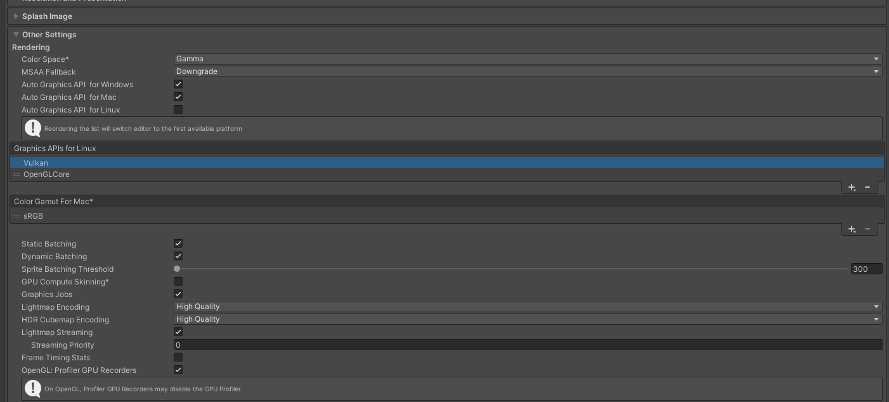
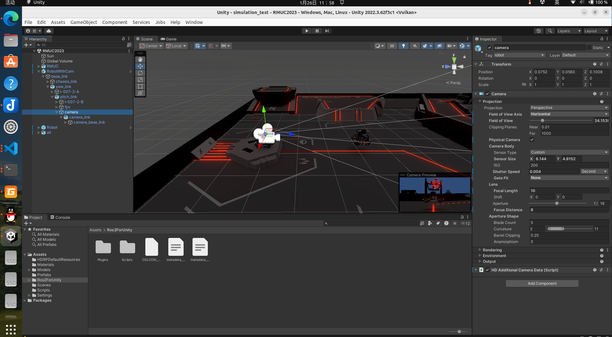

# Unity + ROS2仿真环境配置
## 说明
* 来源于chenjun大佬rm_vision中的[视觉算法仿真器模块](https://github.com/chenjunnn/rm_vision_simulator
)
* 由Unity/Windows+ROS2/wsl -> 整体Linux下
* 由ROS2工程形式 -> C++工程嵌入ROS2节点回调
* [文件地址](https://github.com/xf30364/ROS2-and-Unity-Simulation.git) 仿真工程为simulation_test，可以自行新建文件夹，将Assets文件夹粘到其中;Detect为测试的Demo
##  Unity配置
1.   [安装 UnityHub](https://unity.cn/tuanjie/releases) 在Unity Hub安装Unity，建议**2022.3.62f3c1**
2.   利用安装好的unity打开仿真工程文件
```sh
/home/fx/Unity/Hub/Editor/2022.3.62f3c1/Editor/Unity -projectPath /home/fx/simulation_test/ 
```
3. 如果只有Assets文件夹，需要配置一下系统的渲染选项：
Edit ->  Project Settings -> Player -> OtherSettings -> Rendering 下的Auto Graphics API for Linux 选项取消勾选，并将Vulkan选项放在前面，至于OpenGL是否删除应该都可以，因为linux下是不能使用OpenGL渲染器的，如果没安装Vulkan自行搜索安装


4. 然后将下方工程文件Project -> Scenes -> RMUC2023 拖入左侧（双击应该也可以），此时就可以看到场景了，如果是没有灯光和颜色白模，不要慌，因为我们还有一项渲染选项没有配置。
5. Wndow -> Packsge Manager -> 将Packages: In Project 改为 Unity Registry 然后下拉找到High Definition RP ，这里面包含了我们使用的颜色和天空盒，点击右上角的install
6. 安装完成后点击 Window -> Rendering ->HDRP Wizard  点击 Fix All，然后会提示一个渲染选项，点击创建一个就行，可能比较卡，因为在下载资源
7. 最后就能看到正常的场景了，点击最上面的播放就可以运行仿真环境了，打开rqt或者接收节点就可以看到渲染的图像了，如果**左下角出现红色报错**，首先尝试Assets -> Reimport All，大多可以解决，不行的话那就在Console copy下报错搜索哈
### 说明
1. 仿真工程Asserts文件夹下包含了最核心的东西，Scenes/仿真场景，Scripts/C#脚本以及模型和材料，利用C#脚本可以控制模型的运动，也可以获取模型的位置信息，相机内参信息等等
2. 这里的工程附属了最新版的Ros2ForUnity，如果出现不适配或者其他的问题可以自行下载，解压后放在Assets文件夹下就可以，[Ros2ForUnity](https://github.com/RobotecAI/ros2-for-unity/tags)
3. 相机的具体参数可以手动设置，注意在game运行中配置的参数不会被自动保存，在退出仿真时也要注意保存游戏场景，目前的脚本中存在发布相机内参的节点，但是那个不准，因为同时在脚本里面修改了分辨率，所以懒得修改了但是在使用的时候注意检查，不然会出问题的，手动计算内参也挺简单的 

4. 图像的发布有两个脚本，v1版本是利用的异步形式，原作者用的阻塞形式（不推荐），但是他后续没开源了，就不知道有什么更好的优化方法
5. 由于unity是一个程序，他会根据系统的注意力来分配GPU和CPU资源，所以当你鼠标不点击Unity和点击Unity相比会出现明显的卡顿，可以配合利用rosbag录数据（不如直接录制场地视频，难绷）
6. 如果Unity在使用过程中发生卡顿重新打开进不去，删除缓存文件就可以（除了Assets不建议删其它都能删）
## 工程配置
1. 如果你的工程是ROS2的功能包，那可以直接订阅topic，回调处理就可以了
2. 如果不是ROS2工程，不推荐将你的工程改为ROS2格式，本末倒置的感觉，可以在C++工程中内嵌一个ROS2节点，给一个线程回调就可以，缺点就是需要链接很多库文件和头文件，因为ros2处理链接关系很方便，强行改为传统形式没办法，这里给出一个demo（改自神经网络部署代码，部署环境自行更改，注意架构）在Detect中,先编译camera生成链接库
## 最后
1. 缺点：1.帧率不高，2.容易卡顿，3.与真实调试环境相差很大，很多地方还需要完善
2. 优点：1.个人用起来还比较方便，2.仿真图像质量很高，3.开发性很大，C#脚本比较容易写
3. 里面还有一个雷达反制的模型，不用可以禁掉，如果需要添加模型这里提供一个[转换工具](https://www.3dwhere.com/conv/3DMAX-to-fbx)